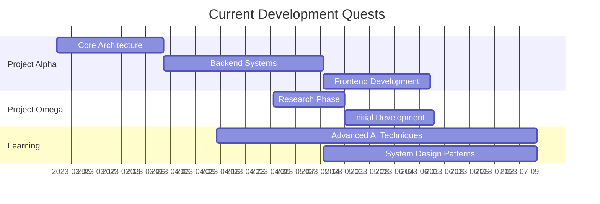

```markdown
# ⚡️ God Mode: Activated ⚡️

<div align="center">
  
  

  [](https://git.io/typing-svg)

  
  
  [](https://git.io/streak-stats)
</div>

## 🌌 System Overview

```typescript
class Developer {
  name: string = "Vansh Bargotra";
  title: string = "Software Engineer / Architect";
  location: string = "Jammu, Jammu & Kashmir";
  specialization: string[] = [
    "Full-Stack Development",
    "Software Architecture",
    "Cloud Infrastructure",
    "DevOps Automation",
    "Performance Optimization"
  ];
  
  constructor() {
    this.initialize();
    this.loadPowerSystems();
  }
  
  private initialize(): void {
    console.log("Activating God Mode...");
    console.log("System online. Ready to create digital wonders.");
  }
}

// Instance now running...
```

## 💻 Tech Arsenal

<div align="center">

[](https://developer.mozilla.org/en-US/docs/Web/JavaScript)
[](https://www.typescriptlang.org/)
[](https://reactjs.org/)
[](https://nodejs.org/)
[](https://www.python.org/)
[](https://golang.org/)

[](https://aws.amazon.com/)
[](https://www.docker.com/)
[](https://kubernetes.io/)
[](https://graphql.org/)
[](https://www.mongodb.com/)
[](https://www.postgresql.org/)

</div>

## 🔮 Current Quests

<div align="center">



</div>

## 🏆 Achievements Unlocked

<div align="center">
  <table>
    <tr>
      <td align="center">
        
      </td>
      <td align="center">
        
      </td>
    </tr>
  </table>
</div>

## 🌠 Developer Philosophy

> "Code is not just a tool; it's a medium for creation. We're digital architects building the infrastructure of tomorrow's world."

I approach software development as a craft that requires both technical precision and creative vision. My work is guided by these principles:

- **Elegant Solutions**: Finding the balance between simplicity and sophistication
- **Continuous Learning**: Technology evolves rapidly, and so should we
- **Ethical Development**: Creating technology that empowers and respects users
- **Performance Obsession**: Optimizing for speed, efficiency, and scale
- **Collaborative Creation**: The best systems emerge from diverse perspectives

## 🌐 Digital Realms

<div align="center">
  
[](
